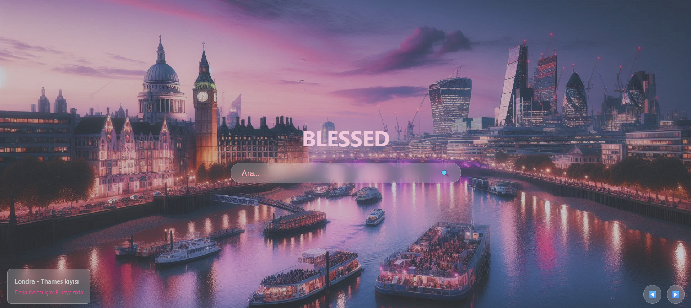

# 🔍 Soft Tone Explore Page 🖥️

Bu proje, Google’dan ilham alınarak tasarlanmış basit ama şık bir sekme sayfası. HTML, Tailwind CSS ve JavaScript kullanılarak yapıldı.

4 farklı şehrin (🗼Paris |🗽 New York |🏯 Tokyo |🎡 Londra ) fotoğrafları yumuşak geçişlerle kayıyor. Kullanıcı “Önceki” ve “Sonraki” butonlarıyla aralarında kolayca gezinebiliyor. Her fotoğrafın altında ilgili şehre dair bilgi almak için tıklanabilir bir link bulunuyor.

Tasarımdaki renkler soft pembe ve mor tonlarında, gözü yormayan, hoş ve sade bir görünüm sağlıyor. Görseller Microsoft Designer ile bu projeye özel olarak üretildi.

## 🖍️ Neler Yapıldı 📝

- Sayfanın temel yapısı oluşturuldu.
- Başlık, arama kutusu, fotoğraf açıklaması ve navigasyon butonları gibi temel bileşenler tanımlandı.
- Fotoğraf bilgisi ve “Daha fazlası için tıkla” linki yerleştirildi.
- Sayfanın renk paleti ve genel görünümü soft pembe ve mor tonlarında düzenlendi.
- Arka plan, butonlar, yazılar ve kutular için yumuşak blur efektleri ve geçiş animasyonları eklendi.
- Responsive ve modern bir tasarım sağlandı.
- Butonların hover ve aktif durumları için görsel efektler kullanıldı.
- Fotoğraflar ve açıklamalar dinamik olarak değiştirildi.
- “Önceki” ve “Sonraki” butonları ile fotoğraf geçişleri kontrol edildi.
- Fotoğraflar 5 saniyede bir otomatik olarak değiştirildi.
- “Daha fazlası için tıkla” linki, her fotoğrafa özel olarak güncellendi.
---

